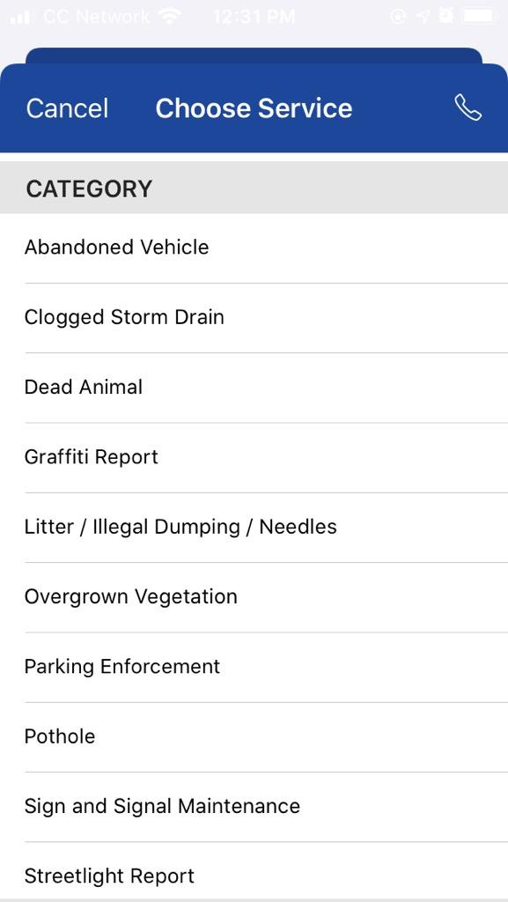
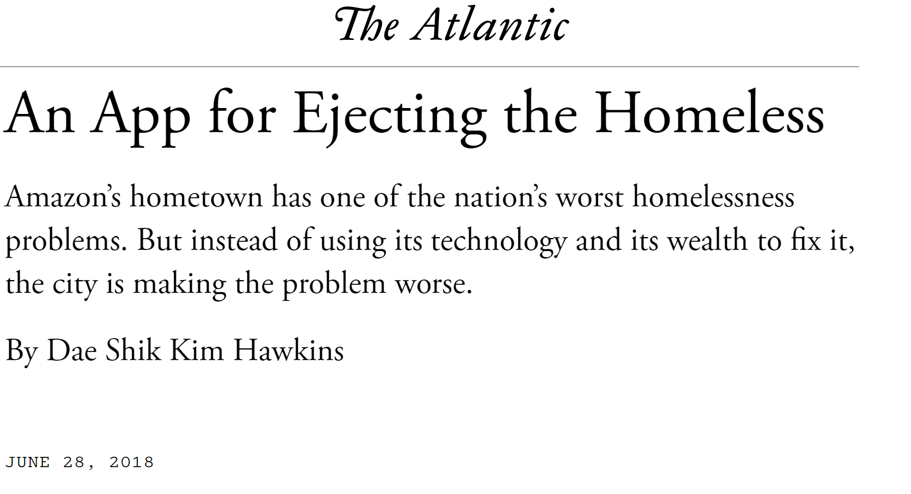
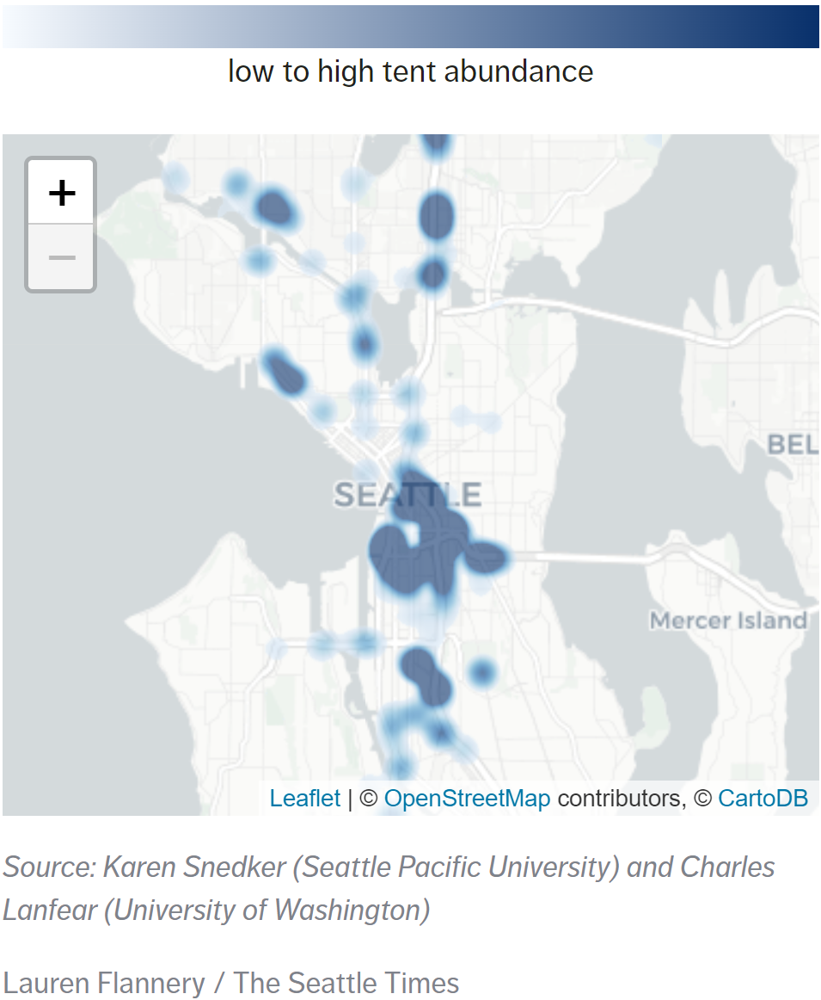
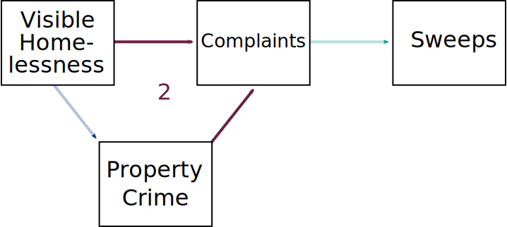
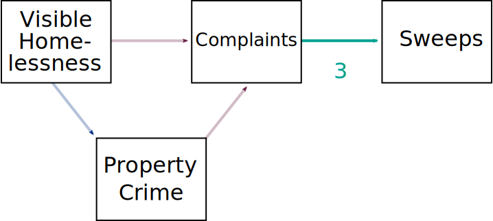
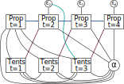
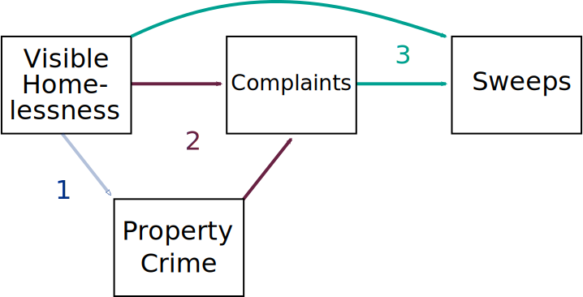

```{r setup, include=FALSE}
library(tidyverse)
library(flextable)
library(showtext)
library(ggforce)
library(lubridate)
library(sf)
library(patchwork)

knitr::opts_chunk$set(echo = TRUE)
nuff_col <- c("Nuffield Teal"  = "#00a191",
  "Nuffield Black" = "#212221",
  "Pure White"     = "#ffffff",
  "Cobalt Blue"    = "#002f87",
  "Rose Red"       = "#e9004c",
  "Electric Blue"  = "#00acc8",
  "Peach Orange"   = "#ffc7be",
  "Pine Green"     = "#00665e",
  "Burgundy"       = "#692044",
  "Sky Blue"       = "#c0dfeb",
  "Celadon Green"  = "#dce0ca")
showtext_auto()
font_add_google("Quattrocento")
```


<br>
<br>

<div style="text-align: center;">
<iframe width="700" height="394" src="https://www.youtube.com/embed/bpAi70WWBlw?start=233&end=401?autoplay=1" frameborder="0" allow="accelerometer; autoplay; encrypted-media; gyroscope; picture-in-picture" allowfullscreen></iframe>
</div>

.centernote[*This has 11.5 million views.*]

---
# Discourse in Seattle

We are told homelessness, drug use, and property crime are out of control.

* Visible social disorder—homelessness and drug use—escalating to serious crime.
* In *Broken Windows* terms, .bam[a spiral of decay].

--

Public discourse reflects the belief that homelessness is associated with property crime fueled by substance use.

* [A prominent report](https://thecisforcrank.com/wp-content/uploads/2019/06/system-failure-prolific-offender-report-feb-2019.pdf) claimed Seattle's most "prolific offenders" are universally homeless, addicted, and allowed to run rampant.

* Addiction justifies .bam[social control]: "they need to be helped"

* But the criminal justice system is portrayed as unwilling or unable to address the problem: .bam[A breakdown of law and order.]

--

.centernote[*But is the initial premise even valid?*]

---

```{r, echo=FALSE, dev='svg', fig.height = 5, dev.args = list(bg = 'transparent')}
load("../../data/derived/output/seattle_crime_rates.RData")
ggplot(seattle_crime_rates, aes(x = year, y = rate, group = name, color= name)) + 
  geom_line(show.legend = FALSE, size = 1.5) + 
  geom_label(data = tibble(year = c(2014,2014), 
                           name = c("property", "violent"),  
                           rate = c(5000, 2000), 
                           text = c("Property", "Violent")),
             aes(label = text, color = name), show.legend=FALSE,
             family = "Quattrocento") +
  xlab("") + ylab("") +
  ylim(0, 6500) +
  scale_color_manual(values = c("property" = unname(nuff_col["Cobalt Blue"]), 
                                "violent" = unname(nuff_col["Burgundy"]))) +
  theme_minimal(base_family = "Quattrocento", base_size = 20) + 
  ggtitle("Crime Rates in Seattle", subtitle = "Known crimes per 100,000 people") +
  scale_x_continuous(breaks = seq(2008, 2020, by = 4)) + 
  theme(legend.title = element_blank(),
        text = element_text(family = "Quattrocento", size = 20, debug = FALSE),
        plot.margin = margin(0, 0, 0, 0),
        panel.grid.minor = element_blank(),
        panel.grid.major.x = element_blank(),
        panel.background = element_rect(fill = "transparent",colour = NA),
        plot.background = element_rect(fill = "transparent",colour = NA))
```

.centernote-high[
### .bam[Recorded property crime *is not* increasing]
]

???

In fact the rate was over 8000 at the end of the 90s---the decline has been long and steady.

---

```{r, echo=FALSE, dev='svg', fig.height = 5, dev.args = list(bg = 'transparent')}
load("../../data/derived/other/pit_counts.RData")
pit_counts %>% 
  filter(year >= 2008 & year <= 2020) %>%
  ggplot(aes(x = year, y = pit_count)) + 
  geom_line(show.legend = FALSE, size = 1.5, color = unname(nuff_col["Burgundy"])) + 
  xlab("") + ylab("") +
  ylim(0, 12500) +
  theme_minimal(base_family = "Quattrocento", base_size = 20) + 
  ggtitle("Homelessness in Seattle", subtitle = "January Point-in-Time counts") +
  scale_x_continuous(breaks = seq(2008, 2020, by = 4)) + 
  theme(legend.title = element_blank(),
        text = element_text(family = "Quattrocento", size = 20, debug = FALSE),
        plot.margin = margin(0, 0, 0, 0),
        panel.grid.minor = element_blank(),
        panel.grid.major.x = element_blank(),
        panel.background = element_rect(fill = "transparent",colour = NA),
        plot.background = element_rect(fill = "transparent",colour = NA))
```

.centernote-high[
### .bam[Homelessness *is* increasing]
]

???

PIT count is the primary method for tracking homelessness in the United States. 

In the last ten days of January, volunteers canvass the area counting people sleeping on the street, in makeshift shelter, in vehicles, as well as in sanctioned shelters.

These counts are going up everywhere in the US, but fastest in cities like Seattle.

---

```{r, echo=FALSE, dev='svg', fig.height = 5, dev.args = list(bg = 'transparent')}
load("../../data/derived/disaggregated/unauthorized_camping_complaints.RData")
unauthorized_camping_complaints %>%
  mutate(date = floor_date(created_date, unit = "month")) %>%
  filter(date < max(date)) %>%
  count(date) %>%
  mutate(marker = ifelse(date >= ymd("2018-12-01") & date <= ymd("2019-02-01"), TRUE, FALSE)) %>%
  ggplot(aes(x = date, y = n)) + 
  geom_line(show.legend = FALSE, size = 1.5, color = unname(nuff_col["Burgundy"])) +
  xlab("") + ylab("") +
  ggtitle("Unauthorized Camping Complaints", subtitle = "Monthly complaints to City of Seattle") +
  geom_mark_rect(aes(label = "Severe Winter", 
                     description = "Record rain, snowfall, and low temperatures" , 
                     filter = marker), fill = unname(nuff_col["Nuffield Teal"]),
                 con.cap = 0) +
  theme_minimal(base_family = "Quattrocento", base_size = 20) + 
  theme(legend.title = element_blank(),
        text = element_text(family = "Quattrocento", size = 20, debug = FALSE),
        plot.margin = margin(0, 0, 0, 0),
        panel.grid.minor = element_blank(),
        panel.grid.major.x = element_blank(),
        panel.background = element_rect(fill = "transparent", colour = NA),
        plot.background = element_rect(fill = "transparent", colour = NA))
```

.centernote-high[
### .bam[*Discontent* appears to be rising]
]

???

While homelessness is increasing rapidly, public complaints about visible homelessness are absolutely exploding in Seattle—though severe weather tempers them a bit.

This suggests discontent with visible homelessness is growing out of pace with either property crime or actual homelessness.

Where do these come from though?

---
## Complaints: Find It, Fix It

.pull-left[
Mobile app introduced by Seattle Customer Service Bureau (CSB) in 2013 for reporting issues like decaying infrastructure, dumping, and abandoned vehicles.

No option for homelessness—unlike San Francisco's 311 app.
]
.pull-right[
.image-full[

]
]

---
count: false
## Complaints: Find It, Fix It

.pull-left[
Mobile app introduced by Seattle Customer Service Bureau (CSB) in 2013 for reporting issues like decaying infrastructure, dumping, and abandoned vehicles.

No option for homelessness—unlike San Francisco's 311 app.

Users have co-opted app to report homelessness under various categories—which has generated controversy.

CSB employees read and manually mark complaints for *unauthorized camping*—.bam[visible homelessness].
]
.pull-right[

<br>

.image-center[

]
]

???

There was a large protest against Find-It, Fix-It as well in 2019; people making false reports, review bombing, posting flyers around the city.

---
# Complaints as Social Control

Research on social control typically focuses on...

* Norm enforcement by the public (informal social control)
* Policing and the courts (formal social control)
* Social welfare compliance mechanisms (formal social control)

--

Unauthorized camping complaints are an alternate appeal to formal social control.

* Potential substitute for ineffective police (or welfare) responses
* May be perceived as less harmful than invoking police<sup>1</sup>
* Agents are empowered to compel movement and seize property: .bam[encampment sweeps]
* Complainants want government to .bam[do something].

???

We actually have text of complaints---people are often angry, demanding *something* be done.

---
class: bg_sweep

# .wo[Sweeps]

???

What, exactly the government does, can include sweeps of encampments.

---
class: bg_sweep_op
count: false

# Sweeps

Sweeps are a formal social control response to "unauthorized camping."


--

Until recently, joint city and police encampment removals:

* 72-hour warning unless hazard or obstruction present
* Offer social services (~15% uptake)
   * Often nightly shelter without secure storage
* Discard waste and store belongings
* Highly discretionary—unobserved selection process

???

Hazards include sanitation and risks like cars. Obstructions are anything impeding use of sidewalk or facility; basically anywhere in a park.

Encampments vary greatly in level of waste and order. Some very visible are stacked with garbage.

--

Negative impacts on unhoused population:

* Deprivation of property and barriers to reacquisition
* Forced relocation

???

These sweeps are potentially the final stage in a process that begins in part with concerns over property crime.

From the text of complaints, this is frequently what complainants are hoping for: removal of the encampment.

Regardless of how safe or pleasant living in encampment is, it is presumably worse to be displaced / lose acquired items.

---
# Our Questions

1. Is the narrative correct, that visible homelessness is driving property crime?

--

2. Are complaints about homelessness actually about visible homelessness... or about crime?

--

3. Do complaints translate into sweeps of encampments?

---
class: inverse
# Data

---
# Measuring Homelessness

Visible signs of homelessness are commonly treated as form of "disorder" in Broken Windows research.


This research often uses complaints to the city as *measure* of disorder prevalence.<sup>1</sup>

.footnote[[1] e.g., [O'Brien & Sampson (2015)](https://journals.sagepub.com/doi/abs/10.1177/0022427815577835)]

--

Social control capacity influences reporting, particularly for minor violations.

This induces spuriousness between complaint-based measures of homelessness and crime.

--

We need a measure of where the unhoused live which is independent of reporting propensity.

---
# The Tent Census

.pull-left[
In April through August of 2019, Karen Snedker and her student research team at Seattle Pacific University conducted a census tents in Seattle.

In Autumn 2019 and Summer 2020, they resampled high density areas to observe change over time—and during COVID-19.

This provides three measures of .bam[visible homelessness] independent of reporting actions.
]
.pull-right[
.image-full[

]
]

???

Collaboration with students. Day-time only. Mix of in-vehicle, on bicycle, and on-foot depending on area, visibility. For I-5, a full car of students (at least 3 plus driver) made multiple passes by different sections with redundant data collection. A number of students used bikes to record along the many bike paths in Seattle. 

On-foot did not reach deep into secluded areas; thus it measures *visible* homelessnes—the kind residents complain about.

Extensive data recording—here I just use locations and counts.

---

.image-tall[
```{r, echo=FALSE, dev='svg', fig.height = 6, dev.args = list(bg = 'transparent')}
load("../../data/derived/other/tent_census_counts.RData")
load("../../data/derived/other/streets_filtered.RData")
load("../../data/derived/other/seattle_nowater.RData")
load("../../data/derived/other/sample_boundaries.RData")
load("../../data/derived/other/freeway_buffer.RData")

sample_areas <- rbind(
  st_as_sf(seattle_nowater) %>%
    rename(geometry = x) %>%
    mutate(sample = "Summer 2019"),
  sample_boundaries %>%
    select(geometry) %>%
    rbind(freeway_buffer) %>%
    summarize(geometry = st_union(geometry)) %>%
    mutate(sample = "Autumn 2019"),
  sample_boundaries %>%
    select(geometry) %>%
    rbind(freeway_buffer) %>%
    summarize(geometry = st_union(geometry)) %>%
    mutate(sample = "Summer 2020")
) %>%
  mutate(sample = factor(sample, levels = c("Summer 2019", "Autumn 2019", "Summer 2020")),
         `Sampled Area` = " ")

ggplot(data = tent_census_counts) + 
  geom_sf(data = seattle_nowater, inherit.aes = FALSE, size = 0.15) + 
  geom_sf(data = streets_filtered, color = nuff_col["Burgundy"], size =0.15, inherit.aes = FALSE, alpha = 0.75) +
  geom_sf(data = sample_areas, 
          aes(fill = `Sampled Area`, color = `Sampled Area`),
          inherit.aes = FALSE, 
          # fill = nuff_col["Cobalt Blue"], 
          # color = nuff_col["Cobalt Blue"],
          alpha = 0.4,
          size = 0.15) +
  scale_fill_manual(values = c(" " = unname(nuff_col["Cobalt Blue"]))) +
  scale_color_manual(values = c(" " = unname(nuff_col["Cobalt Blue"]))) +
  geom_sf(alpha = 0.5, 
          aes(size = n_dwellings), 
          color = nuff_col["Nuffield Black"], shape = 21, fill = nuff_col["Nuffield Teal"]) + 
  coord_sf(expand = FALSE, clip = "off") +
  facet_wrap(~ sample) +
  scale_size_continuous("Number of Tents", breaks = c(1, 5, 25, 50)) +
  theme_void() + 
  theme(plot.margin = margin(0, 0, 0, 0),
        panel.background = element_rect(fill = "transparent",colour = NA),
        plot.background = element_rect(fill = "transparent",colour = NA),
        legend.position = c(0.5, -0.1), legend.direction = "horizontal", legend.box = "horizontal",
        strip.text = element_text(size = rel(1.5), 
                                  family = "Quattrocento", 
                                  color = nuff_col["Nuffield Black"], 
                                  margin = margin(b=15)),
        legend.title = element_text(size = rel(1.2), 
                                    family = "Quattrocento", 
                                    color = nuff_col["Nuffield Black"]))
```
]

???

The resample locations were based on old Seattle neighborhood planning areas, which do not conform to any census designations---and also had no official shapefiles. Made shapefiles myself from the hand drawings.

---
## Unauthorized Camping Complaints

Seattle Customer Service Bureau (CSB) handles non-criminal complaints.

--

.bam[Unauthorized camping] is a narrow definition—classified by CSB—which does not encompass all complaints involving visible homelessness.

--

In recent years, most complaints are made via *Find It, Fix It* mobile app

* Introduced in late 2013
* Camping complaints not widespread until 2016
* Complaints have nearly doubled each year since

--

We focus today on data from 2019 after unauthorized camping complaints via *Find It, Fix It* became common, and which coincide with the Tent Census.

---
# Other Data

For today:

* Seattle Police Department (SPD) property crime

   + Theft (68%), Burglary (21%), Auto Theft (11%)

* City of Seattle encampment sweep logs

--

Not shown today:

* SPD Customer Service Survey

  * Fear of crime
  * Satisfaction with police

* Tent Cities and Tiny House Villages<sup>1</sup>

.footnote[[1] A [report by the Guardian](https://www.theguardian.com/us-news/2018/may/23/homeless-villages-crime-rate-seattle-portland) and an unpublished study by Dartmouth applied economics students indicate crime is *lower* near these sanctioned encampments.]

---

```{r, echo=FALSE, dev='svg', fig.height = 6, dev.args = list(bg = 'transparent')}
load("../../data/derived/other/data_dates.RData")
rect_data <- expand.grid(value = seq.Date(min(data_dates$value), max(data_dates$value), by = "month"),
                         source = unique(data_dates$source)) %>%
  mutate(date_filter = value >= as.Date("2019-04-04") & value <= as.Date("2019-07-09"))
        
ggplot(data_dates %>% mutate(in_use = ifelse(source %in% c("SPD Survey", "Tent Cities"), "no", "yes"))) + 
  geom_line(aes(x = value, group = group, y = source, color = in_use), size = 10) +
  scale_color_manual(values = c("yes" = unname(nuff_col["Burgundy"]), "no" = unname(nuff_col["Cobalt Blue"])), ) +
  #geom_rect(aes(xmin=as.Date("2019-04-04"), 
  #              xmax=max(as.Date(unauthorized_camping_complaints$created_date)), 
  #              ymin=0, ymax=Inf), alpha = 0.5, fill = nuff_col["Nuffield Teal"]) +
  geom_mark_rect(data = rect_data,
                 aes(label = "Overlap",
                                        x = value,
                                        y = source,
                     group = NA,
                     filter = date_filter), 
                     fill = unname(nuff_col["Nuffield Teal"]),
                 con.cap = 0) +
  ylab("") + 
  xlab("") + 
  ggtitle("Data Availability") +
  theme_minimal(base_family = "Quattrocento", base_size = 20) +
  theme(plot.margin = margin(0, 0, 0, 0),
        panel.grid.major.y = element_blank(),
        panel.background = element_rect(fill = "transparent",colour = NA),
        plot.background = element_rect(fill = "transparent",colour = NA),
        legend.position = "none")
```

???

Ton of data, but only one span has everything of interest.

In theory may be able to get more complaint data; can definitely get more sweeps but have to manually code it. Both are on agenda.

---
class: inverse
# Analysis


---
# Our Questions

.image-300[

]

1. Does visible homelessness predict nearby property crime?

???

The narrative implies—or even explicitly claims—that visibly homeless people engage in property crime, especially where they are living. If this is the case, property crime should be higher near camps.

---
count: false
# Our Questions

.image-300[

]

1. Does visible homelessness predict nearby property crime?

2. Are complaints driven by property crime or visible homelessness?

???

If property crime is wedded to visible homelessness in the minds of the public---at least some of the public---then they may be motivated to complain to the city by property crime in the area. This may especially be the case if they don't think conventional routes like police will work.

---
count: false
# Our Questions

.image-300[

]

1. Does visible homelessness predict nearby property crime?

2. Are complaints driven by property crime or visible homelessness?

3. Do complaints lead to formal social control actions—encampment sweeps?

???

Lastly, we want to know if those complaints actually result in actions. Complaints about homelessness may be inconsequential if they don't result in action by the city.


---
class: inverse
# Question 1:

### Does visible homelessness predict nearby property crime?

???


What we're interested in is if one could randomly assign encampments to different locations, would those areas see more property crime?

This is the most developed question in the project, because we have the most data for it and it is probably of the most general interest.

Existing evidence is somewhat sparse for this---the best comes from interventions clearing encampments, but those are likely compound treatments and typically applied to more problematic encampments.

May also be asymmetrical effects of removing camps and adding ones---I don't test here though.


---
# Challenges

* Many potential confounders

   * Most important are relatively time-stable
      * e.g., social control, built environment

???

Unhoused folks may set up tents in high crime, low social control, high opportunity locations

--

* Reciprocality if property crime leads to displacement

--

* Only 3 waves of tent census (small T), with inconsistent spans and spacing

   * Summer 2019
   * Late Autumn 2019
   * Spring-Summer 2020

--

* Complicated geographical units

   * Tents and crime are point data
   * Only certain areas resampled
     * e.g., the Interstate 5 highway corridor
     
---
# Approach

1. Aggregate to US census blockgroups

  * Minimizes inclusion of unsampled area
  * Sufficient sample size and counts of property crime
  * Incorporates physical boundaries

???

Vast majority of the extra block group area unsampled in resamples had no tents in first wave

Pondering doing something street-grid based. If someone has ideas for applying this kind of approach in continuous space, let me know.

---
count:false

.image-tall[
```{r, echo=FALSE, dev='svg', fig.height = 6, dev.args = list(bg = 'transparent')}

load("../../data/derived/other/dpm_blockgroups.RData")
load("../../data/derived/bg/seattle_bg_boundaries.RData")
left_plot <- ggplot(data = tent_census_counts) + 
  geom_sf(data = seattle_nowater, inherit.aes = FALSE, size = 0.15) + 
  geom_sf(data = streets_filtered, color = nuff_col["Burgundy"], size =0.15, inherit.aes = FALSE, alpha = 0.75) +
  geom_sf(data = sample_areas %>% filter(sample == "Summer 2020"), 
          aes(fill = `Sampled Area`, color = `Sampled Area`),
          inherit.aes = FALSE, 
          # fill = nuff_col["Cobalt Blue"], 
          # color = nuff_col["Cobalt Blue"],
          alpha = 0.4,
          size = 0.15) +
  scale_fill_manual(values = c(" " = unname(nuff_col["Cobalt Blue"]))) +
  scale_color_manual(values = c(" " = unname(nuff_col["Cobalt Blue"]))) +
  geom_sf(alpha = 0.5, 
          aes(size = n_dwellings), 
          color = nuff_col["Nuffield Black"], shape = 21, fill = nuff_col["Nuffield Teal"]) + 
  coord_sf(expand = FALSE, clip = "off") +
  scale_size_continuous("Number of Tents", breaks = c(1, 5, 25, 50)) +
  theme_void() + 
  ggtitle("Sampled Areas")+
  theme(plot.margin = margin(0, 15, 0, 0))

right_plot <- ggplot() + 
  geom_sf(data = seattle_nowater, inherit.aes = FALSE, size = 0.15) + 
  geom_sf(data = streets_filtered, color = nuff_col["Burgundy"], size =0.15, inherit.aes = FALSE, alpha = 0.75) +
  geom_sf(data = seattle_bg_boundaries %>% 
            filter(blockgroup %in% dpm_blockgroups) %>%
            mutate(`Sampled Blockgroup` = " "), 
          aes(fill = `Sampled Blockgroup`, color = `Sampled Blockgroup`),
          inherit.aes = FALSE, 
          # fill = nuff_col["Cobalt Blue"], 
          # color = nuff_col["Cobalt Blue"],
          alpha = 0.4,
          size = 0.15) +
  scale_fill_manual(values = c(" " = unname(nuff_col["Nuffield Teal"]))) +
  scale_color_manual(values = c(" " = unname(nuff_col["Nuffield Teal"]))) +
  coord_sf(expand = FALSE, clip = "off") +
  theme_void() + 
  ggtitle("Sampled Blockgroups") +
  theme(plot.margin = margin(0, 0, 0, 15))
  
(left_plot + right_plot) * 
  theme(plot.margin = margin(0, 0, 0, 0),
        panel.background = element_rect(fill = "transparent",colour = NA),
        plot.background = element_rect(fill = "transparent",colour = NA),
        legend.position = "none",
        plot.title = element_text(size = rel(1.75),
                                  hjust = 0.5,
                                  margin = margin(0, 0, 25, 0),
                                    family = "Quattrocento", 
                                    color = nuff_col["Nuffield Black"]),
        legend.title = element_text(size = rel(1.2), 
                                    family = "Quattrocento", 
                                    color = nuff_col["Nuffield Black"]))
```
]

???

Sampled blockgroups exclude any with no variation in property crime or tents across all waves.

---
# Approach

1. Aggregate to US census blockgroups

  * Minimizes inclusion of unsampled area
  * Sufficient counts of property crime
  * Incorporates physical boundaries

2. .bam[Maximum likelihood fixed-effects cross-lagged panel estimator]<sup>1</sup>

* Asymptotically equivalent to Arellano-Bond GMM
   * Addresses time-stable confounders
   * Avoids Nickell bias
* Advantages:
   * High efficiency
   * Less biased with small N or strong autoregression
   * Coefficients and error variances can vary between waves
  
.footnote[
[1] See [Allison et al. (2017)](https://journals.sagepub.com/doi/full/10.1177/2378023117710578) and [Moral-Benito et al. (2018)](https://doi.org/10.1080/00036846.2018.1540854)
]

???

Vast majority of the extra block group area unsampled in resamples had no tents in first wave

Pondering doing something street-grid based. If someone has ideas for applying this kind of approach in continuous space, let me know.

Very similar results logging outcome; taking bad log + 1 similar result, worse fit. DPM complicated to set up with Poisson link---probably only MPLUS supports.

---
count:false

<br>

.image-full[

]

???

SEM visual notation: Double-arrow for covariance, single for regression.

Allison's model is essentially one side of a cross-lag model; 4 waves of prop crime, three of which are endogenous, and three waves of tents. Alpha is latent variable for time-stable unobservables.

Predictors allowed to covary with all error terms which precede them in time---that is, they are predetermined or sequentially exogenous rather than strictly exogenous.


---
# Tents and Crime Results

.pull-left[
```{r, echo=FALSE}
load("../../data/derived/output/dpm_prop_bg_table_data.RData")

dpm_prop_bg_table_data %>%
  mutate(Lag  = ifelse(str_detect(Term, "-"), 
                       Term, 
                       str_replace(Term, "\\)", 
                paste0("\U2192", as.numeric(str_extract(Term, "\\d")) +1, ")" ))),
         Lag = str_remove_all(Lag, "(^[A-Za-z]+ )|\\(|\\)"),
         Term = str_remove(Term, " .+$")) %>%
  flextable(col_keys = c("Term", "Lag", "Constrained", "Free")) %>%
  width(j=1 , width = 1.5) %>%
  add_header_lines("Standardized coefficients") %>%
  add_header_lines("Estimated Effects on Property Crime") %>%
  border_remove() %>%
  merge_v(j = 4) %>%
  hline_bottom(border = officer::fp_border(width = 1), part = "body") %>%
  hline(border = officer::fp_border(width = 1), i=2, part = "header") %>%
  hline_top(border = officer::fp_border(width = 0.5)) %>%
  padding(padding = 2, part = "all") %>%
  bg(i = c(3,4, 7, 8), bg = "grey90") %>%
  align(j = c(2,3,4), align = "center", part = "all") %>%
  color(i = c(1,3,5,7), j = c(1,3,4), color = nuff_col["Burgundy"]) %>%
  color(i = c(1,3,5,7)+1, j = c(1,3,4), color = nuff_col["Cobalt Blue"]) %>%
  fix_border_issues(part = "all") %>%
  add_footer_lines("N = 41 (blockgroups), T = 3 (waves)")
```
]
.pull-right[
#### Highlights

* Near zero or negative relationship between dwellings and crime

* Similar results across specifications

   + Weak evidence for burglary, but not theft, auto theft, or violence

* Preference for unconstrained lagged effects

* Lagged effects preferred over contemporaneous effects
]

???

Only 3 degrees of freedom in unconstrained model; insignificant Chi-square

Covariance between prop and tents is negative but small: -0.05 to -0.10; tent AR term is between 0.4 and 0.6.

Once demeaned there isn't any bivariate relationship---.08 correlation between prop and tents

In a pure cross-section model using only the full-city census, there's a tiny positive significant relationship

If asked about rates, similar results but issues with spurious correlation of ratios.

---
class: inverse
# Question 2:

### Are complaints driven by property crime or visible homelessness?

???

Simpler question: What predicts people making appeals to formal social control about homelessness.

Is it just seeing it? Or is it connected to property crime?

If people associated visible homelessness with property crime, they may address property crime by trying to control visible homelessness.

---
# Methods

&zwj;Challenge:

* Only one period has both complaints and tent census
* Complaints are highly-skewed count

???

Main problem is not a lot of data: Single cross-section.

--

&zwj;Approach: .bam[Poisson-lognormal regression]

   * Cross-sectional analysis
   * Observation-level random effect for dispersion
   * Adjust for correlates of opportunity and social control:
      * Concentrated disadvantage<sup>1</sup>
      * Home ownership
      * Population density
      * Violent crime
   * Spatial lag of property crime

.footnote[
[1] Following [Sharkey's (2014)](https://www.journals.uchicago.edu/doi/full/10.1086/674561) operationalization.
]

???

Many ways to deal with overdispersion, whether modeling directly or just adjusting standard errors.

I took a modeling approach here as the dispersion is easily captured; resulting residuals are homoscedastic.

I limit the number of controls to basic antecedents in social disorganization theory; things are highly correlated, so there's not a lot of power to work with. Violent crime here is trying to proxy a bit for social control mainly.

I include a spatial lag of property crime for two reasons: (1) people may pay attention to crime in relatively large areas, and (2) alternatively, people may complain in nearby areas while considering crime where they live.

---
# Crime and Complaints Results

.pull-left[
```{r, echo=FALSE}
load("../../data/derived/output/glmer_table.RData")
glmer_table %>%
flextable(col_keys = c("Term", "Estimate")) %>%
  width(j=1 , width = 1.5) %>%
  add_header_lines("Log-count per SD(Term)") %>%
  add_header_lines("Estimated Association with Complaints") %>%
  border_remove() %>%
  hline_bottom(border = officer::fp_border(width = 1), part = "body") %>%
  hline(border = officer::fp_border(width = 1), i=2, part = "header") %>%
  hline_top(border = officer::fp_border(width = 0.5)) %>%
  padding(padding = 2, part = "all") %>%
  align(j = 2, align = "center", part = "all") %>%
  color(i = 1, j = 1:2, color = nuff_col["Burgundy"]) %>%
  color(i = 2:3, j = 1:2, color = nuff_col["Cobalt Blue"]) %>%
  add_footer_lines("N = 477 (blockgroups)")
```
]

.pull-right[
#### Highlights

* Property crime predicts unauthorized camping complaints net of visible homelessness

   + Spatial lag nearly as predictive

* Each reported property crime associated with ~1.4% more complaints

* Each tent associated with ~3.4% more complaints
]

???

Parameter estimates largely similar in conventional poisson with sandwich errors, but quite large SEs, generally awful model fit.

Tents have larger per unit relationship, but property crime has much larger mean (25 vs 1.75) and SD (35 vs. 9).

While home ownership is just a control here, I tested an interaction with prop crime and tents; very strong positive interaction with prop crime, which would be consistent with expectation: prop crime drives resident complaints.

No interaction between prop crime and tents---complaints not more sensitive to tents where crime is high.

If asked about rates: Unclear denominator---what is complaints per person? Does city act on rate or number?

---
class: inverse
# Question 3

### Do complaints lead to formal social control actions—encampment sweeps?

???

Again, a straightforward question: Do complaints translate into enforcement actions?


Also interesting if there is a perception that calling police fails to produce results, but using a roundabout social control method results in direct action.

---
# Methods

&zwj;Challenges:

* Sweeps are infrequent
   * 97 recorded
* Still minimal data overlap
   * 44 sweeps in tent census period
* Little overdispersion 

???

Similar to complaints but worse. Only one period where we can link to tents and complaints, and even less power than before.

--

&zwj;Approach: .bam[Poisson regression]

* Better fit than lognormal, similar results
* HC3 standard errors
* Same cross-sectional specification as complaints

???


Did not expect spatial effects here---sweeps should be tightly linked to tents (what gets sweeped) and complaints, which are location specific. Tested anyway, found only very weak and inconsequential tent lag.

---
# Sweeps Results

.pull-left[
```{r, echo=FALSE}
load("../../data/derived/output/pois_table.RData")
pois_table %>%
flextable(col_keys = c("Term", "Estimate")) %>%
  width(j=1 , width = 1.5) %>%
  add_header_lines("Log-count per SD(Term)") %>%
  add_header_lines("Estimated Association with Sweeps") %>%
  border_remove() %>%
  hline_bottom(border = officer::fp_border(width = 1), part = "body") %>%
  hline(border = officer::fp_border(width = 1), i=2, part = "header") %>%
  hline_top(border = officer::fp_border(width = 0.5)) %>%
  padding(padding = 2, part = "all") %>%
  align(j = 2, align = "center", part = "all") %>%
  color(i = 1, j = 1:2, color = nuff_col["Burgundy"]) %>%
  color(i = 2, j = 1:2, color = nuff_col["Cobalt Blue"]) %>%
  add_footer_lines("N = 477 (blockgroups)")
```
]
.pull-right[

#### Highlights

* Complaints and tents similar predictors of sweeps

* Each complaint associated with ~1% more sweeps

* Each tent associated with ~ 3.7% more sweeps

* At mean of other covariates:

  * 1 sweep expected at ~12 complaints
  * 1 sweep expected at ~11 tents
]

---
# Summary

.image-300[

]

* Changes in visible homelessness not strongly associated with changes in property crime

* Complaints associated with both visible homelessness and property crime

* Sweeps associated with both complaints and visible homelessness

---
# Implications

* Narrative conflating visible homelessness with property crime may be unwarranted

   + "Misplaced blame"

???

If these results are roughly accurate, they have some implications.

No surprising to many who research in area, but likely to receive pushback from public, police, etc.

NPR interview

--

* Strong association between complaints about homelessness and property crime—net of *actual visible homelessness*—suggests this conflation may lead to social control *demands*.

???

The important thing here is not that complaints are higher where there is property crime, but that they're higher conditional on visible homelessness.

--

* Further, these demands appear to translate into formal social control *actions* by city government—with consequences for the unhoused population.

   + "Misplaced sanctions"

???

Irony here is misplaced blame for property crime---which is deprivation of people's property---may be leading to deprivation of property of unhoused population.

---
# Caveats and Concerns

* Technical limitations and questions

   * Low statistical power in panel model
   * Confounding in cross-sectional models
   * Treatment heterogeneity
      + e.g. "Problem encampments"
   * Spatial effects
   * Spatial units

???

Squeezing blood from a stone. Effects in panel model are weak or negative, but fair argument that tests are underpowered.

Reasonable to expect spatial effects in property crime, but insufficient power to detect.

--

* What about police and resident experiences?

   * Undeniable signs of criminal activity in some camps
   * Visibility of crime versus amount of crime
   * Opportunity and proximity are complicated

???

Police and residents regularly report observing crimes or evidence of crimes undeniably linked to some camps

Visibility may be a key issue: Much of perceived effect of camps may be increased visibility of both offenders and evidence

Some individuals may choose location to camp for reasons of criminal opportunity, but will take advantage even if not nearby

May also, again, be treatment heterogeneity

Importantly, of course, must recognize that some encampments simply make residents feel unsafe and may impact use of public spaces and facilities.

--

* Is crime up, but reporting to police down?

???

Relationship between camps and prop crime could be confounded by reporting differences; I don't doubt some reporting has declined---one of most common social media narratives is useless and unresponsive police.

Prop crime strongly predicts another form of reporting however---complaints. They don't appear to be substituting, but the relationship might be complex.

---
# Recent Developments

* COVID-19

   * Sweeps paused ~1 year
   * Changes in homelessness and social control


--

* In 2021, the Navigation Team was replaced by Homelessness Outreach and Provider Ecosystem (HOPE) Team

   * No embedded police
   * Does not participate in sweeps / removals
   * Conducts outreach prior to city removals

--

* Expanded housing options

   * Hotel-based options
   * New shelters

???

In short, context of homelessness and social control may have changed somewhat since data were collected

But narrative appears to be pretty similar

---
# Future Directions

.pull-left[
Where are tents located?

   * Physical characteristics (roads, bridges, parks)
   * Social characteristics (stability, social control)

Complaints and adverse weather

   * 2020 and 2021 severe winters
   * June 2021 heat dome (> 42°C)

Police effectiveness

   * May impact reporting

]
.pull-right[
Alternate measures

   * Point-in-Time Counts
   * Needle reports

Effects of sweeps

   * Crime
   * Tents and complaints

]

---
# Acknowledgements

.pull-left[
### Special Thanks

* SPU Student Research Team

* Loren Atherley, Seattle Police Department

* Claudia Gross-Shader, City of Seattle

* Idris Beauregard, Seattle Public Utilities
]

.pull-left[
### Funding

* Seattle Pacific University

* Phinney Ridge Lutheran Church

]

---
count: false
class: inverse

# Thank You

