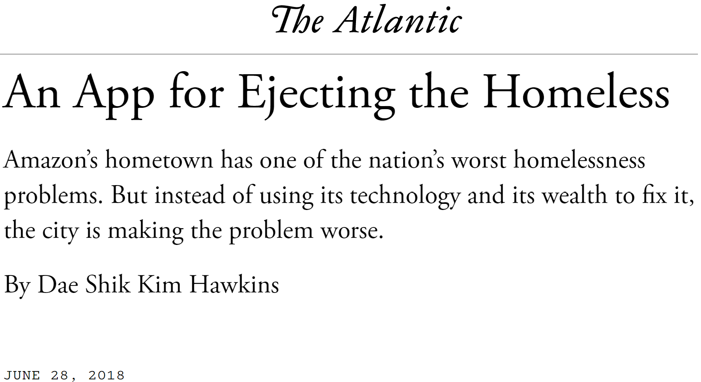

```{r setup, include=FALSE}
library(tidyverse)
library(flextable)
library(showtext)
library(ggforce)
library(lubridate)

knitr::opts_chunk$set(echo = TRUE)
nuff_col <-
c("Nuffield Teal"  = "#00a191",
  "Nuffield Black" = "#212221",
  "Pure White"     = "#ffffff",
  "Cobalt Blue"    = "#002f87",
  "Rose Red"       = "#e9004c",
  "Electric Blue"  = "#00acc8",
  "Peach Orange"   = "#ffc7be",
  "Pine Green"     = "#00665e",
  "Burgundy"       = "#692044",
  "Sky Blue"       = "#c0dfeb",
  "Celadon Green"  = "#dce0ca")
showtext_auto()
font_add_google("Quattrocento")
```


<br>
<br>

<div style="text-align: center;">
<iframe width="700" height="394" src="https://www.youtube.com/embed/bpAi70WWBlw?start=233&end=401?autoplay=1" frameborder="0" allow="accelerometer; autoplay; encrypted-media; gyroscope; picture-in-picture" allowfullscreen></iframe>
</div>

---
# The Narrative

We are told homelessness, drug use, and property crime are out of control.
* In Broken Windows terms, .bam[a spiral of decay].

--

[A prominent report](https://thecisforcrank.com/wp-content/uploads/2019/06/system-failure-prolific-offender-report-feb-2019.pdf) claims Seattle's most "prolific offenders" are universally homeless, addicted, and allowed to run rampant.
* .bam[A breakdown of law and order.]

--

The homeless fund substance use with property crime.

* The unhoused as motivated offenders
* Addiction justifies .bam[social control]: "they need to be helped"

--

Cause is tied hands of police, defacto drug decriminalization, and absence of compulsory treatment.

--

.centernote[*But is the initial premise even valid?*]

---

```{r, echo=FALSE, dev='svg', fig.height = 5, dev.args = list(bg = 'transparent')}
load("../../data/derived/output/seattle_crime_rates.RData")
ggplot(seattle_crime_rates, aes(x = year, y = rate, group = name, color= name)) + 
  geom_line(show.legend = FALSE, size = 1.5) + 
  geom_label(data = tibble(year = c(2014,2014), 
                           name = c("property", "violent"),  
                           rate = c(5000, 2000), 
                           text = c("Property", "Violent")),
             aes(label = text, color = name), show.legend=FALSE,
             family = "Quattrocento") +
  xlab("") + ylab("") +
  ylim(0, 6500) +
  scale_color_manual(values = c("property" = unname(nuff_col["Cobalt Blue"]), 
                                "violent" = unname(nuff_col["Burgundy"]))) +
  theme_minimal(base_family = "Quattrocento", base_size = 20) + 
  ggtitle("Crime Rates in Seattle", subtitle = "Known crimes per 100,000 people") +
  scale_x_continuous(breaks = seq(2008, 2020, by = 4)) + 
  theme(legend.title = element_blank(),
        text = element_text(family = "Quattrocento", size = 20, debug = FALSE),
        plot.margin = margin(0, 0, 0, 0),
        panel.grid.minor = element_blank(),
        panel.grid.major.x = element_blank(),
        panel.background = element_rect(fill = "transparent",colour = NA),
        plot.background = element_rect(fill = "transparent",colour = NA))
```

.centernote-high[
### .bam[Crime *is not* increasing.]
]

---

```{r, echo=FALSE, dev='svg', fig.height = 5, dev.args = list(bg = 'transparent')}
load("../../data/derived/other/pit_counts.RData")
pit_counts %>% 
  filter(year >= 2008 & year <= 2020) %>%
  ggplot(aes(x = year, y = pit_count)) + 
  geom_line(show.legend = FALSE, size = 1.5, color = unname(nuff_col["Burgundy"])) + 
  xlab("") + ylab("") +
  ylim(0, 12500) +
  theme_minimal(base_family = "Quattrocento", base_size = 20) + 
  ggtitle("Homelessness in Seattle", subtitle = "January Point-in-Time counts") +
  scale_x_continuous(breaks = seq(2008, 2020, by = 4)) + 
  theme(legend.title = element_blank(),
        text = element_text(family = "Quattrocento", size = 20, debug = FALSE),
        plot.margin = margin(0, 0, 0, 0),
        panel.grid.minor = element_blank(),
        panel.grid.major.x = element_blank(),
        panel.background = element_rect(fill = "transparent",colour = NA),
        plot.background = element_rect(fill = "transparent",colour = NA))
```

.centernote-high[
### .bam[Homelessness *is* increasing.]
]

---

```{r, echo=FALSE, dev='svg', fig.height = 5, dev.args = list(bg = 'transparent')}
load("../../data/derived/disaggregated/unauthorized_camping_complaints.RData")

unauthorized_camping_complaints %>%
  mutate(date = floor_date(created_date, unit = "month")) %>%
  filter(date < max(date)) %>%
  count(date) %>%
  mutate(marker = ifelse(date >= ymd("2018-12-01") & date <= ymd("2019-02-01"), TRUE, FALSE)) %>%
  ggplot(aes(x = date, y = n)) + 
  geom_line(show.legend = FALSE, size = 1.5, color = unname(nuff_col["Burgundy"])) +
  xlab("") + ylab("") +
  ggtitle("Unauthorized Camping Complaints", subtitle = "Monthly complaints to City of Seattle") +
  geom_mark_rect(aes(label = "Severe Winter", 
                     description = "Record rain, snowfall, and low temperatures" , 
                     filter = marker), fill = unname(nuff_col["Nuffield Teal"])) +
  theme_minimal(base_family = "Quattrocento", base_size = 20) + 
  theme(legend.title = element_blank(),
        text = element_text(family = "Quattrocento", size = 20, debug = FALSE),
        plot.margin = margin(0, 0, 0, 0),
        panel.grid.minor = element_blank(),
        panel.grid.major.x = element_blank(),
        panel.background = element_rect(fill = "transparent", colour = NA),
        plot.background = element_rect(fill = "transparent", colour = NA))
```

.centernote-high[
### .bam[Complaints are *exploding*]
]

???

Feb 2019 had massive snowstorm

---
# Complaints as Social Control

Research on social control typically focuses on...

* Sanctioning by the public (informal social control)
* Policing and the courts (formal social control)
* Social welfare regulation (formal social control)

--

Unauthorized camping complaints are an alternate appeal to formal social control.

* Potential substitute for ineffective police (or welfare) responses
* Perceived as less harmful than invoking police<sup>1</sup>
* Agents are empowered to compel movement and seize property: .bam[encampment sweeps]

.footnote[[1] Complaints end up in the same Navigation Team pool as police calls.]

---
class: bg_sweep

# .wo[Sweeps]


---
class: bg_sweep_op
count: false

# Sweeps

Sweeps are the ultimate formal social control response to "unauthorized camping"

--

Joint city and police encampment removals:

* Offer social services (~15% uptake)
   * Often nightly shelter without secure storage
* Discard "waste" and store "belongings"
* Highly discretionary, unobserved selection process

--

Negative impacts on unhoused population

* Deprivation of property
   * Barriers to reacquisition
* Forced relocation
* Fear and anxiety over future sweeps
* Alienation from city services and agents

---
# Our Questions

* Is the narrative correct, that visible homelessness is driving property crime?

--

* Are complaints about homelessness actually about visible homelessness... or about crime?

--

* Do complaints translate into sweeps of encampments?

---
class: inverse
# Data

---
## Complaints: Find It, Fix It

.pull-left[
Mobile app introduced in 2013 for reporting issues like decaying infrastructure, dumping, and abandoned vehicles.

No option for homelessness--unlike San Francisco's 311 app.
]
.pull-right[
.image-full[

]
]

---
count: false
## Complaints: Find It, Fix It

.pull-left[
Mobile app introduced by Seattle Customer Service Bureau (CSB) in 2013 for reporting issues like decaying infrastructure, dumping, and abandoned vehicles.

No option for homelessness--unlike San Francisco's 311 app.

Users have co-opted app to report homelessness under various categories.

CSB employees read and manually mark complaints for .bam[unauthorized camping].
]
.pull-right[

<br>

.image-center[

]
]

---
# Measuring Homelessness

Visible homelessness is commonly considered a form of disorder, such as in the Broken Windows thesis.


Research on disorder and crime frequently uses complaints to the city as a *measure* of prevalence of disorder.<sup>1</sup>

.footnote[[1] e.g., [O'Brien & Sampson (2015)](https://journals.sagepub.com/doi/abs/10.1177/0022427815577835) ]

--

Social control capacity influences reporting, particularly for minor violations.

This induces spuriousness between complaint-based measures of homelessness and crime.

--

We need a measure of homelessness independent of reporting propensity.

---
# The Tent Census

.pull-left[
In April through August of 2019, Karen Snedker's team at Seattle Pacific University conducted a census of encampments for her tent cities project.

In Autumn 2019 and Summer 2020, they resampled high density areas to observe change over time.

This provides three measures of .bam[visible homelessness] independent of reporting.
]
.pull-right[
.image-full[

]
]
---

.image-tall[
```{r, echo=FALSE, dev='svg', fig.height = 6, dev.args = list(bg = 'transparent')}
load("../../data/derived/other/tent_census_counts.RData")
load("../../data/derived/other/streets_filtered.RData")
load("../../data/derived/other/seattle_nowater.RData")

ggplot(data = tent_census_counts) + 
  geom_sf(data = seattle_nowater, inherit.aes = FALSE) + 
  geom_sf(data = streets_filtered, color = nuff_col["Burgundy"], inherit.aes = FALSE) + 
  geom_sf(alpha = 0.5, 
          aes(size = n_dwellings), 
          color = nuff_col["Nuffield Black"], shape = 21, fill = nuff_col["Nuffield Teal"]) + 
  coord_sf(expand = FALSE) +
  facet_wrap(~ sample) +
  scale_size_continuous("Number of Tents or Structures", breaks = c(1, 5, 25, 50)) +
  theme_void() + 
  theme(plot.margin = margin(0, 0, 0, 0),
        panel.background = element_rect(fill = "transparent",colour = NA),
        plot.background = element_rect(fill = "transparent",colour = NA),
        legend.position = "bottom",
        strip.text = element_text(size = rel(2), family = "Quattrocento", color = nuff_col["Nuffield Black"], margin = margin(b=2)),
        legend.title = element_text(size = rel(1.4), family = "Quattrocento", color = nuff_col["Nuffield Black"]))
```
]

---
# Other Data

For today:

* Seattle Police Department (SPD) known property crimes

* City of Seattle encampment sweep logs

Not shown today:

* SPD Customer Service Survey

  * Fear of crime
  * Satisfaction with police

* SPD known violent crimes

* Tent Cities and Tiny House Villages

---

```{r, echo=FALSE, dev='svg', fig.height = 6, dev.args = list(bg = 'transparent')}
load("../../data/derived/other/data_dates.RData")
ggplot() + 
  geom_line(data = data_dates, aes(x = value, group = group, y = source), size = 5, color = nuff_col["Burgundy"]) + 
  geom_rect(aes(xmin=as.Date("2019-04-04"), 
                xmax=max(as.Date(unauthorized_camping_complaints$created_date)), 
                ymin=0, ymax=Inf), alpha = 0.5, fill = nuff_col["Nuffield Teal"]) +
  ylab("") + 
  xlab("") + 
  ggtitle("Data Availability") +
  theme_minimal(base_family = "Quattrocento", base_size = 20) +
  theme(plot.margin = margin(0, 0, 0, 0),
        panel.grid.major.y = element_blank(),
        panel.background = element_rect(fill = "transparent",colour = NA),
        plot.background = element_rect(fill = "transparent",colour = NA),
        legend.position = "bottom")
```

---
class: inverse
# Analysis


---
# Our Questions

.image-300[

]

1. Does visible homelessness lead to property crime?

---
count: false
# Our Questions

.image-300[

]

1. Does visible homelessness lead to property crime?

2. Are complaints driven by property crime or visible homelessness?


---
count: false
# Our Questions

.image-300[

]

1. Does visible homelessness lead to property crime?

2. Are complaints driven by property crime or visible homelessness?

3. Do complaints lead to formal social control actions--encampment sweeps?

---
class: inverse
# Question 1:

### Does visible homelessness lead to property crime?


---
# Methods

&zwj;Challenges:

* Many potential confounders
   * Most relatively time-stable (e.g., social control, built environment)
* Only 3 waves of tent census (small T)
* Inconsistent time spans and wave spacing
* Only certain areas resampled (small N: 41 blockgroups)

--

&zwj;Approach: .bam[Maximum likelihood fixed-effects cross-lagged panel estimator]<sup>1</sup>

* Asymptotically equivalent to Arellano-Bond GMM
   * Addresses time-stable confounders, avoids Nickell bias
   * More efficient
   * Less biased with small N or strong autoregression
* Allows lagged effects and error variance to vary between waves

.footnote[
[1] See [Allison et al. (2017)](https://journals.sagepub.com/doi/full/10.1177/2378023117710578) and [Allison et al. (2018)](https://doi.org/10.1080/00036846.2018.1540854)
]

???

Very similar results with rates or logging outcome; log tends to fit a bit better but there are zeroes. DPM complicated to set up with Poisson link.

---

<br>

.image-full[

]

???

Teal correlation between epsilon 2 and Tents 3 makes tents 3 predetermined or sequentially exogenous rather than strictly exogenous.

---
# Results

.pull-left[
```{r, echo=FALSE}
load("../../data/derived/output/dpm_prop_bg_table_data.RData")
dpm_prop_bg_table_data %>%
  # mutate(Term = ifelse(str_detect(Term, "-"), 
  #                      Term, 
  #                      str_replace(Term, "\\)", 
  #               paste0("\U2192", as.numeric(str_extract(Term, "\\d")) +1, ")" )))) %>%
  mutate(Lag  = ifelse(str_detect(Term, "-"), 
                       Term, 
                       str_replace(Term, "\\)", 
                paste0("\U2192", as.numeric(str_extract(Term, "\\d")) +1, ")" ))),
         Lag = str_remove_all(Lag, "(^[A-Za-z]+ )|\\(|\\)"),
         Term = str_remove(Term, " .+$")) %>%
  flextable(col_keys = c("Term", "Lag", "Constrained", "Free")) %>%
  width(j=1 , width = 1.5) %>%
  add_header_lines("Standardized coefficients") %>%
  add_header_lines("Estimated Effects on Property Crime") %>%
  border_remove() %>%
  merge_v(j = 4) %>%
  hline_bottom(border = officer::fp_border(width = 1), part = "body") %>%
  hline(border = officer::fp_border(width = 1), i=2, part = "header") %>%
  hline_top(border = officer::fp_border(width = 0.5)) %>%
  padding(padding = 2, part = "all") %>%
  bg(i = c(3,4, 7, 8), bg = "grey90") %>%
  align(j = c(2,3,4), align = "center", part = "all") %>%
  color(i = c(1,3,5,7), j = c(1,3,4), color = nuff_col["Burgundy"]) %>%
  color(i = c(1,3,5,7)+1, j = c(1,3,4), color = nuff_col["Cobalt Blue"]) %>%
  fix_border_issues(part = "all")
```
]
.pull-right[
Highlights

* Near zero or negative relationship between dwellings and crime

* Similar results across specifications
]

---
class: inverse
# Question 2:

### Are complaints driven by property crime or visible homelessness?


---
# Methods

&zwj;Challenges:

* Only one period has both complaints and tent census
* Many potential confounders

--

&zwj;Approaches:

* Crude cross-sectional analysis with homelessness
* Many time-period DPM with only complaints and crime

Long series here allows for DPM again; can run both sides of model

---
# Cross-Section


---
# Crime and Complaints Results


---
# Tents, Crime, and Complaints

---
# Sweeps

* Manually coded from Navigation Team reports

---
# Crime, Complaints, and Sweeps

Have a few waves for sweeps... but count or endogenous binary

Can I do a logit outcome on sweeps?

Interact complaints with median income or something?

---
# Future Directions

* Where are tents located?
   * Physical characteristics (roads, bridges, parks)
   * Social characteristics (stability, social control)
   
   A [report by the Guardian](https://www.theguardian.com/us-news/2018/may/23/homeless-villages-crime-rate-seattle-portland) and an unpublished study by Dartmouth applied economics students both found negative associations between crime and tent cities and tiny house villages in Seattle.