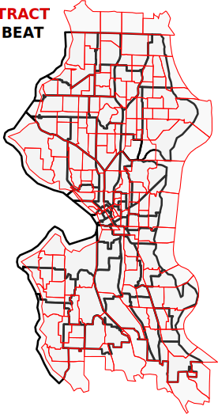
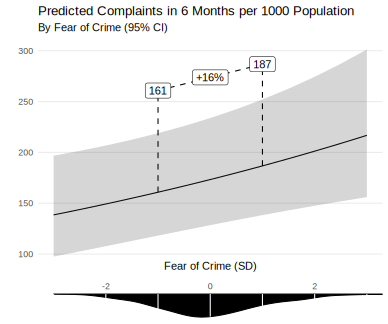
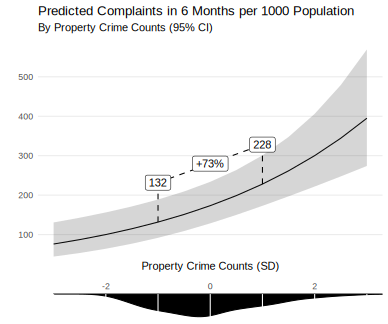

```{r setup, include=FALSE, purl=FALSE}
options(htmltools.dir.version = FALSE)
knitr::opts_chunk$set(comment = "##")
library(gt)
```

```{r xaringan-themer, include = FALSE, purl=FALSE}
# library(xaringanthemer)
# source("./centrism_css.R")
```

# Complaints as Social Control

Research on social control typically focuses on...

* Sanctioning by the public (informal social control)
* Police-initiated contacts (formal social control)
* Citizen-initiated police contacts (formal social control)<sup>1</sup>

.footnote[[1] See Herring (2019) for a recent discussion.]

--

Complaining to the city is an alternate appeal to formal social control.

* It defers responsibility to authorities
* Agents are empowered to sanction, compel movement, and seize property
* May be substitute or compliment for other social control forms

---
class: inverse

# Data

---
## Tent Census

In April through August of 2019, Karen Snedker's research team at Seattle Pacific University conducted a comprehensive census of tents for her tent cities project.

---
## Unauthorized Camping

Seattle Customer Service Bureau handles most public complaints

**Unauthorized camping** is a specific category
* Does not encompass all complaints involving visible homelessness
* We will explore other complaint types in future (e.g. illegal dumping)

Most complaints made via *Find It, Fix It* mobile app
* Introduced in late 2013
* Use has increase exponentially since introduction

We focus on data from 2016 to 2019 when unauthorized camping complaints via *Find It, Fix It* became common

---
## Police RMS Incidents

SPD records all police contacts involving an offense in their records management system (RMS)
* Exact geolocation
* Detailed data on type of offense

We use a complete record of all offense reports to generate beat-level measures:
* Property offense
* Violent offense
* Public order offenses

Today we focus on **property offenses**

---
## Customer Satisfaction Survey

SPD conducts quarterly random phone surveys of individuals who called 911.
* Excludes victims of serious crimes
* On average 200 surveys per quarter
* Covers 2006 through present
* Geographically identified at police beat level

Survey questions:
* 3 questions on **fear of crime**
* 10 on police efficacy.
* Changes in perceptions due to 911 event
* Race and gender

We focus on **fear of crime**.

---
## ACS

ACS 5-year estimates for tract-level population<sup>1</sup>

Used to calculate rates and adjust for population and density.

Model-based approaches needed to match our spatial or temporal units.

.footnote[[1] Census API issues prevented obtaining block group data.]

---
class: inverse
# Tents, Crime, Fear, and Complaints

---
# Models

One year of rolling tent census recording permits only cross-sectional analyses.
* Only 51 police beats means low statistical power
* Cross-section prevents analyzing change

Results reported are holistic summaries from many model specifications representing different tradeoffs.
* Negative binomial models with (rates) and without (counts) population offsets 
* Linear models with rates and counts for conditionally normal variables

---
# Property and Violent Crime

Tents not associated with counts of property or violent crimes.
* No available statistical controls induce any relationship.

Weakly associated with *rates* but effect driven entirely by very low population industrial beats (e.g. SoDo).
* Industrial areas vulnerable to property crime are also suitable for camping.
* Controlling for population eliminates relationship.

*There is no evidence tents are associated with property crime.*

---
# Fear of Crime

Fear of crime is predicted by violent crime.

Fear is not associated with property crime.

*Tents are also not associated with fear of crime.*

---
# Camping Complaints

Unauthorized camping complaints are predicted by property crime, tent counts, and fear of crime
* Not predicted by violent crime, conditional on fear.

*Factors seemingly independent of visible homelessness predict complaints.*

---
# Complaints, Fear, and Crime

Homelessness is associated with crime in the minds of the public, particularly property crime.
* Property crime is not increasing substantially in Seattle
* Visible homelessness appears to be increasing
* Public discourse reflects increasing concerns with property crime

Increasing visible homelessness has been accompanied by increases in unauthorized camping complaints.

These complaints may represent attempts at crime control--an alternate form of formal social control.

Thus, complaints may be patterned not by the underlying visible homeless population, but by the distribution of fear and property crime.

Question: To what degree are increases in complaints driven by fear of crime and property crime?

---
# The Approach

Neither fear nor property crime are predicted by tents.
* If tents capture visible homelessness, then visible homelessness is conditionally independent of fear and property crime.
* *Visible homeless is not a confounder.*

.image-50[

]

We can thus estimate the relationships between fear and property crime and complaints.

---
## Data Analysis Process

.image-full[

]


---
### Multilevel Measurement Model

.image-full[

]

---
# Power-Reliability Tradeoff

Fixed effects models need many time periods for power.

Hierarchical measurement models need many respondents per unit for reliability.

Half-years seems to be the sweet spot.


---
# Areal Weighting

.pull-left[
Beats are not linked to any demographic variables.

Census tracts and beats have different boundaries.

Areal weighting can be used to interpolate census measures to beats.

Areal weighting was also used to reconcile beat boundaries that change over time.

Census population was extrapolated to 2019 and interpolated to half-years.

These methods make moderate assumptions about distribution and growth in population.
]
.pull-right[
.image-full[

]
]

---
# Modeling Strategy

I use a negative binomial model with **fixed effects** and **time trends** at the beat-level.
* Estimate per-resident complaint rate using population as exposure.

Spatial lag of fear of crime to account for spatial dependence.
* Cannot use endogenous spatial lag in exponential family models.
* Prop crime and spatial lag of prop crime too highly correlated (~.64).

Moran's I on residuals indicates no spatial dependence

No temporal autocorrelation.

---
# Results

```{r, echo=FALSE, message=FALSE, warning=FALSE}
load("./output/coef_table.RData")
coef_table %>%
  tab_header(title = "Complaint Rate Model Estimates", subtitle ="Beat intercepts and trends omitted") %>%
  tab_spanner(label = "Complaint Counts", columns = c("Est.", "SE", "p")) %>%
   cols_label(Est. = html("Std. Est."))
```

---

.image-full[

]

---

.image-full[

]

---
# Summary

Complaints to city services are a form of formal social control not unlike calls to police.

Complaints are a function of:
* Visible homelessness
* Fear of Crime
* Property Crime

While visible homelessness is not associated with either property crime or fear of crime, complaints about visible homelessness are related to both.

Property crime and fear of crime may contribute to excessive social control of this vulnerable population.