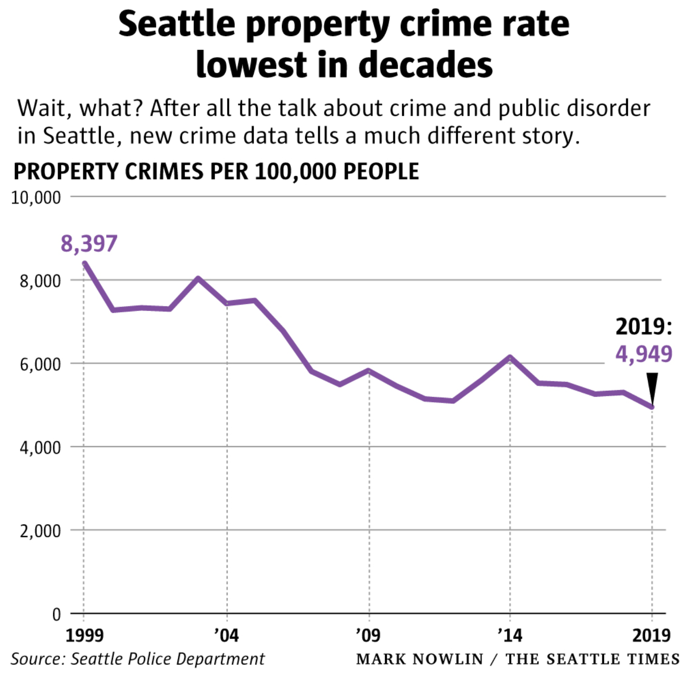
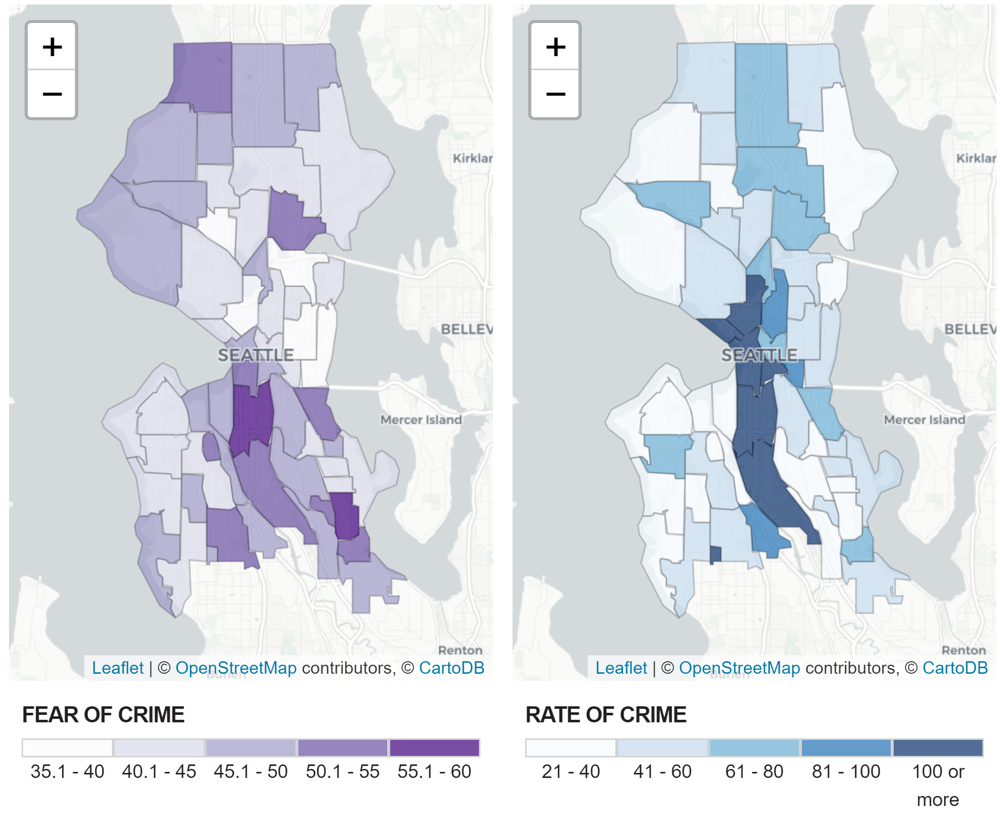
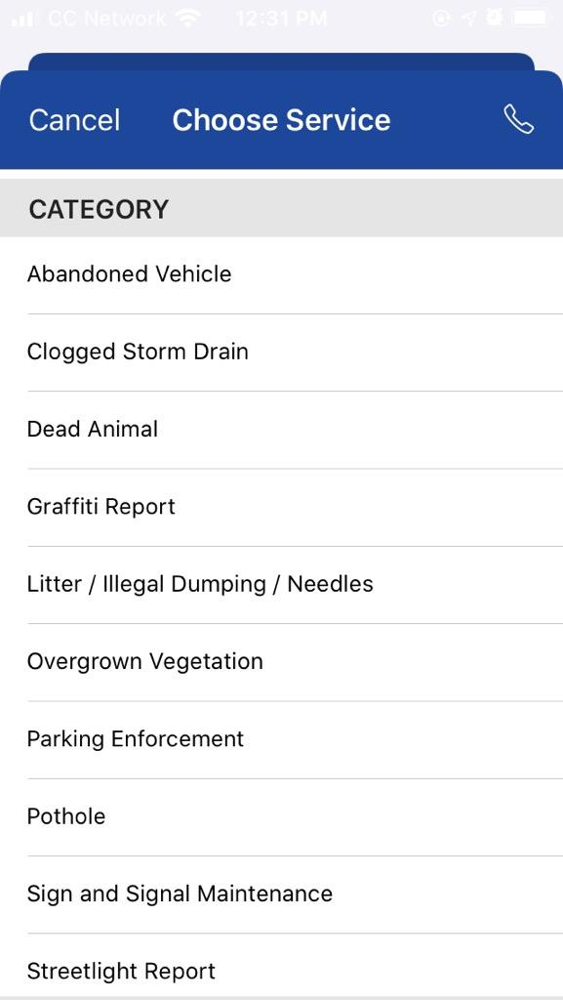
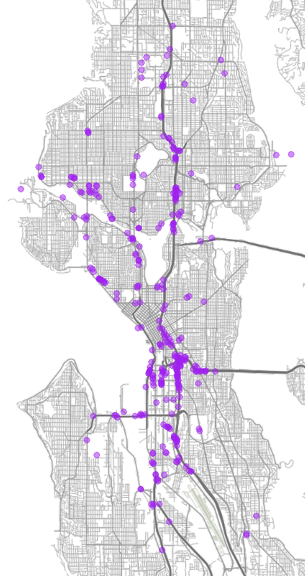

```{r setup, include=FALSE, purl=FALSE}
options(htmltools.dir.version = FALSE)
knitr::opts_chunk$set(comment = "##")
library(gt)
```


## Homelessness, Drugs, and Crime

<div style="text-align: center;">
<iframe width="700" height="394" src="https://www.youtube.com/embed/bpAi70WWBlw?start=233&end=401?autoplay=1" frameborder="0" allow="accelerometer; autoplay; encrypted-media; gyroscope; picture-in-picture" allowfullscreen></iframe>
</div>

---
# Discourse in Seattle

We are told homelessness, drug use, and property crime are out of control.

[A prominent report](https://thecisforcrank.com/wp-content/uploads/2019/06/system-failure-prolific-offender-report-feb-2019.pdf) claims Seattle's most "prolific offenders" are universally homeless and addicted.

Public discourse reflects the belief that homelessness is associated with property crime fueled by substance use.
* Substance use used to justify social control--"they need to be helped"

The explanation is tied hands of police, defacto drug decriminalization, and an unwillingness to engage in compulsory treatment.

--

But is the initial premise even valid?

---
# Crime

.image-full[

]

---
# Homelessness

[Point-in-time counts](http://allhomekc.org/wp-content/uploads/2019/09/KING-9.5-v2.pdf) indicate the unsheltered population has been fairly stable since 2009.

A [report by the Guardian](https://www.theguardian.com/us-news/2018/may/23/homeless-villages-crime-rate-seattle-portland) and an unpublished study by Dartmouth applied economics students both found negative associations between crime and tent cities and tiny house villages.

---
# Fear of Crime

.image-full[

]

---
# Complaints, Fear, and Crime

Homelessness appears associated with crime in the minds of Seattle's public, particularly property crime.
* Property crime is not increasing
* Homelessness is not increasing

--

*Fear* and *discontent* appear to be rising

Complaints to the city for issues related to homelessness have increased exponentially for years.

---
## Complaints and Find It, Fix It

.pull-left[
Mobile phone app meant for reporting issues like decaying infrastructure, dumping, and abandoned vehicles.

No option for homelessness--unlike San Francisco's 311 app.

Users have co-opted app to report homelessness under various categories.

CSB employees read and manually mark complaints for *Unauthorized Camping*.
]

.pull-right[
.image-full[

]
]
---
# Complaints as Social Control

Research on social control typically focuses on...

* Sanctioning by the public (informal social control)
* Police-initiated contacts (formal social control)
* Citizen-initiated police contacts (formal social control)<sup>1</sup>

.footnote[[1] See Herring (2019) for a recent discussion.]

--

Complaining to the city is an alternate appeal to formal social control.
* Agents are empowered to sanction, compel movement, and seize property
* May be a substitute or complement for other social control forms
* May be perceived as less harmful than invoking police... though complaints end up in the same Navigation Team pool.
* Complainants *want government to do something*.

---
# Our Questions

Complaints about homelessness may be patterned not by the underlying visible homeless population, but by the distribution of fear and property crime.

To what degree are increases in complaints related to...
   * Fear of crime
   * Property crime
   * Tents and makeshift structures (visible homelessness)

---
class: inverse

# Data Sources

* Tent Census

* Unauthorized Camping Complaints

* Police RMS Incidents

* SPD Customer Satisfaction Survey

* American Community Survey

---
## Tent Census

.pull-left[
In April through August of 2019, Karen Snedker's research team at Seattle Pacific University conducted a comprehensive census of tents and makeshift structures for her tent cities project.

This provides a measure of *visible homelessness* independent of social control actions such as citizen reports or police contacts.

This census is more granular than available point-in-time data--which is also collected only in January.
]
.pull-right[
.image-full[

]
]

---
## Unauthorized Camping

Seattle Customer Service Bureau (CSB) handles non-criminal complaints.

**Unauthorized camping** is a narrow definition--classified by CSB--which does not encompass all complaints involving visible homelessness

In recent years, most complaints are made via *Find It, Fix It* mobile app
* Introduced in late 2013
* Camping complaints not widespread until 2016
* Complaints have nearly doubled each year

We focus on data from **2016** to **2019** after unauthorized camping complaints via *Find It, Fix It* became common.

---
## Police RMS Incidents

SPD records all police contacts involving an offense in their records management system (RMS)
* Exact geolocation
* Detailed data on type of offense

We use a complete record of all offense reports to generate beat-level measures:
* Property offenses
* Violent offenses

Today we focus on **property offenses**

---
## Customer Satisfaction Survey

SPD conducts quarterly random phone surveys of individuals who called 911.
* On average 200 surveys per quarter, 2006 through present
* Geographically identified at **police beat** level
* Excludes victims of serious crimes

Survey questions:
* 3 questions on **fear of crime**:
   + "Overall, how safe do you personally feel in Seattle?"
   + "Overall, how safe do you feel walking alone in your neighborhood during the day?"
   + "And, overall, how safe do you feel walking alone in your neighborhood at night?
* Changes in perceptions due to 911 event and police response
* Race and gender
* 911 call type and dispensation

We focus on **fear of crime**.

---
## American Community Survey

ACS 5-year estimates for tract-level population<sup>1</sup>

Used to calculate rates and adjust for population and density.

Model-based approaches needed to match our spatial or temporal units.

.footnote[[1] Census API issues prevented obtaining block group data.]

---
class: inverse
# Tents, Crime, Fear, and Complaints

---
# Models

We have data from one year of rolling tent census recording, but are restricted to beat-level analyses by our survey data.
* Only 51 police beats means low statistical power
* Cross-section prevents analyzing change

Results reported are holistic summaries from many model specifications representing different tradeoffs.
* Negative binomial models with (rates) and without (counts) population offsets 
* Linear models with rates and counts for conditionally normal variables

---
# Property and Violent Crime

Tents not associated with counts of property or violent crimes.
* No available transformations or controls induce any relationship.

Tents weakly associated with property crime *rates* but effect driven entirely by very low population industrial beats (e.g. SoDo).
* Industrial areas vulnerable to property crime are also suitable for camping.
* Controlling for population eliminates relationship.

*There is no evidence tents are associated with property crime.*

---
# Fear of Crime

Fear of crime is associated with violent crime.

Fear of crime is *not* associated with property crime.

*Tents are also not associated with fear of crime.*

---
# Camping Complaints

Unauthorized camping complaints are predicted by property crime, tent counts, and fear of crime.
* Not predicted by violent crime, conditional on fear.

*Factors seemingly independent of visible homelessness predict complaints.*

---
# The Approach

Neither fear nor property crime are predicted by tents.
* If tents capture visible homelessness, then visible homelessness is conditionally independent of fear and property crime.
* *Prevalence of visible signs of homeless is not a confounder.*

<div style="text-align: center;">
.image-50[

]
</div>

*Absent this confounding, we can leverage repeated observations to estimate the relationships between fear and property crime and complaints.*

---
# Data Analysis Process

.image-full[

]

---
## Multilevel Factor Model

.pull-left[
.image-full[

]
]
.pull-right[
Model combines: 
* Confirmatory factor analysis
* Hierarchical measurement model

Adjusts for: 
* Measurement error in indicators
* Differential composition of beats on observables

Produces beat-level **empirical Bayes residuals**: Average fear of crime shrunk toward zero based on inter-rater reliability.
]

---
# Power-Reliability Tradeoff

Fixed effects models need many time periods for power.

Hierarchical measurement models need many respondents per unit for reliability.

.image-center[

]

Half-years seems to be the sweet spot.
* Years have large standard errors.
* Quarters have unreliable fear of crime estimates.

---
# Areal Weighting

.pull-left[
Beats are not linked to any demographic variables.

Census tracts and beats have different boundaries.

Areal weighting was used to interpolate census measures to beats and reconcile beat boundaries that change over time.

Census population was extrapolated to 2019 and interpolated to half-years.
]
.pull-right[
.image-full[

]
]

---
# Modeling Strategy

We use a negative binomial model with beat-specific **fixed effects** and **time trends**.
* Estimate per-resident complaint rate using population as exposure.
* Models without exposure offset replicate results.

Spatial lag of fear of crime to account for spatial dependence.
* Cannot use endogenous spatial lag in exponential family models.
* Property crime and spatial lag of propert crime too highly correlated to include (~.64).

Moran's I on residuals indicates no spatial dependence

No temporal autocorrelation in autoregressed residuals.

---
# Results

```{r, echo=FALSE, message=FALSE, warning=FALSE}
load("./output/coef_table.RData")
coef_table %>%
  tab_header(title = "Complaint Rate Model Estimates", subtitle ="Beat intercepts and trends omitted") %>%
  tab_spanner(label = "Complaint Counts", columns = c("Est.", "SE", "p")) %>%
   cols_label(Est. = html("Std. Est."))
```


---

.image-full[

]

---

.image-full[

]

---
# Summary

Complaints to city services are a form of formal social control not unlike calls to police.

Complaints appear to be a function of:
* Visible homelessness
* Fear of Crime
* Property Crime

While visible homelessness is not associated with either property crime or fear of crime, complaints about visible homelessness are related to *both*.

Property crime and fear of crime may contribute to excessive social control of this vulnerable population.

---
# Moving Forward

Additional Measures
* Sweeps
* All Home Point in Time Counts
* Police Efficacy
* Public Order Offenses
* Illegal dumping and needles<sup>1</sup>

Conceptualizing E-Community Policing
* NextDoor
* Neighbors
* Find It, Fix It

.footnote[
[1] [Needle complaints are often mainly about homelessness](https://www.google.com/url?q=https://www.kuow.org/stories/i-looked-at-1-000-photos-tagged-needles-in-seattle-many-of-them-showed-something-else&source=gmail&ust=1579296829431000&usg=AFQjCNEdc720498pQuYZ7yMZcHeYHqkIzw)
]